# Network Verification & Architecture Documentation

## 1. Network Architecture & Topology

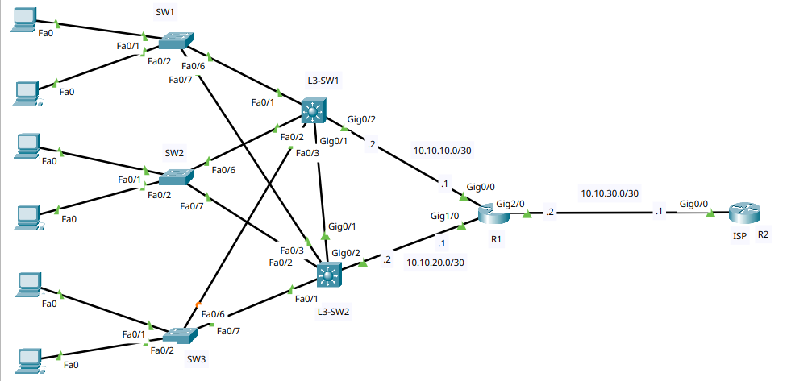

**Core Interconnections & IP Addressing Scheme**

* **Access Layer to Core/Distribution**:
  * **SW1** (VLAN 10 - IT): Trunked via `Fa0/6` $\rightarrow$ `L3-SW1` (`Fa0/1`) and `Fa0/7` $\rightarrow$ `L3-SW2` (`Fa0/1`).
  * **SW2** (VLAN 20 - HR): Trunked via `Fa0/6` $\rightarrow$ `L3-SW1` (`Fa0/2`) and `Fa0/7` $\rightarrow$ `L3-SW2` (`Fa0/2`).
  * **SW3** (VLAN 30 - SALES): Trunked via `Fa0/6` $\rightarrow$ `L3-SW1` (`Fa0/3`) and `Fa0/7` $\rightarrow$ `L3-SW2` (`Fa0/3`).

* **Core Trunk Interconnect**:
  * **L3-SW1** $\leftrightarrow$ **L3-SW2**: Interconnected via `Gig0/1` trunk for inter-switch communications, HSRP monitoring, and STP redundancy.

* **Core Layer to Edge Router (R1)**:
  * **L3-SW1** (`Gig0/2` | `10.10.10.2/30`) $\leftrightarrow$ **R1** (`Gig0/0` | `10.10.10.1/30`)
  * **L3-SW2** (`Gig0/2` | `10.10.20.2/30`) $\leftrightarrow$ **R1** (`Gig1/0` | `10.10.20.1/30`)

* **Edge Router (R1) to ISP Gateway (R2)**:
  * **R1** (`Gig2/0` | `10.10.30.2/30`) $\leftrightarrow$ **ISP R2** (`Gig0/0` | `10.10.30.1/30`)

---

## 2. Access Layer VLANs (`show vlan brief`)

* **SW1 (IT Department)**: VLAN 10 (`IT`) assigned to `Fa0/1 - Fa0/5` and `Fa0/8 - Fa0/24`.  
  

* **SW2 (HR Department)**: VLAN 20 (`HR`) assigned to `Fa0/1 - Fa0/5` and `Fa0/8 - Fa0/24`.  
  

* **SW3 (Sales Department)**: VLAN 30 (`SALES`) assigned to `Fa0/1 - Fa0/5` and `Fa0/8 - Fa0/24`.  
  

---

## 3. STP Security (`PortFast` & `BPDU Guard`)

* **SW1**: Access ports configured with `spanning-tree portfast` and `spanning-tree bpduguard enable`.  
  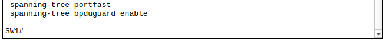

* **SW2**: Access ports configured with `spanning-tree portfast` and `spanning-tree bpduguard enable`.  
  

* **SW3**: Access ports configured with `spanning-tree portfast` and `spanning-tree bpduguard enable`.  
  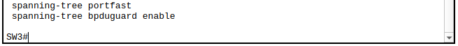

---

## 4. Trunking Links (`show interfaces trunk`)

* **SW1**: `802.1q` trunking active on `Fa0/6` & `Fa0/7` (allowing VLAN 10).  
  

* **SW2**: `802.1q` trunking active on `Fa0/6` & `Fa0/7` (allowing VLAN 20).  
  

* **SW3**: `802.1q` trunking active on `Fa0/6` & `Fa0/7` (allowing VLAN 30).  
  

* **L3-SW1**: Multi-VLAN trunking active on `Fa0/1`, `Fa0/2`, `Fa0/3`, and `Gig0/1` (allowing VLANs 10, 20, 30).  
  

* **L3-SW2**: Multi-VLAN trunking active on `Fa0/1`, `Fa0/2`, `Fa0/3`, and `Gig0/1` (allowing VLANs 10, 20, 30).  
  

---

## 5. Layer 3 Switch SVIs (`show ip interface brief`)

* **L3-SW1 SVIs**:
  * `Vlan10`: `192.168.10.254/24` (Up/Up)
  * `Vlan20`: `192.168.20.254/24` (Up/Up)
  * `Vlan30`: `192.168.30.254/24` (Up/Up)  
  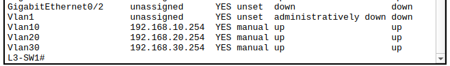

* **L3-SW2 SVIs**:
  * `Vlan10`: `192.168.10.253/24` (Up/Up)
  * `Vlan20`: `192.168.20.253/24` (Up/Up)
  * `Vlan30`: `192.168.30.253/24` (Up/Up)  
  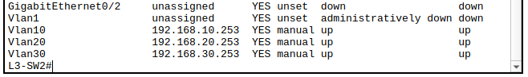

---

## 6. HSRP First-Hop Redundancy (`show standby brief`)

* **L3-SW1 HSRP State**:
  * **Active Router** for `VLAN 10` (Priority 110 | Virtual IP `192.168.10.1`)
  * **Active Router** for `VLAN 20` (Priority 110 | Virtual IP `192.168.20.1`)
  * **Standby Router** for `VLAN 30` (Priority 90 | Virtual IP `192.168.30.1`)  
  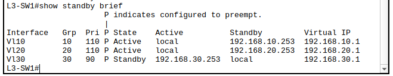

* **L3-SW2 HSRP State**:
  * **Standby Router** for `VLAN 10` (Priority 90 | Virtual IP `192.168.10.1`)
  * **Standby Router** for `VLAN 20` (Priority 90 | Virtual IP `192.168.20.1`)
  * **Active Router** for `VLAN 30` (Priority 110 | Virtual IP `192.168.30.1`)  
  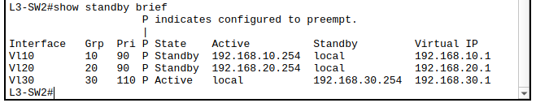

---

## 7. Spanning Tree Root Placement (`show spanning-tree vlan X`)

* **L3-SW1 Root Bridge Status**:
  * **VLAN 10**: Primary Root Bridge (`Priority 4106`)  
    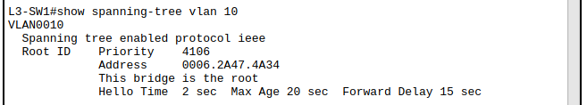
  * **VLAN 20**: Primary Root Bridge (`Priority 4116`)  
    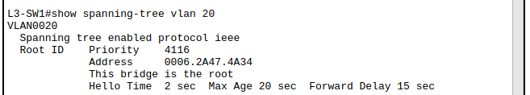
  * **VLAN 30**: Secondary Root / Non-Root (`Priority 8222` | Root Port `Gi0/1`)  
    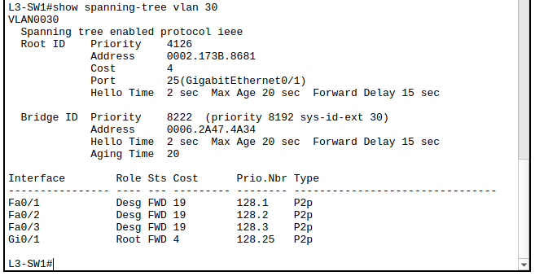

* **L3-SW2 Root Bridge & Backup Status**:
  * **VLAN 30**: Primary Root Bridge (`Priority 4126`)  
    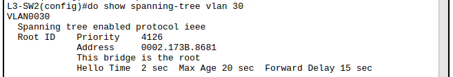
  * **VLAN 10**: Secondary Root / Non-Root (`Priority 8202`)  
    
  * **VLAN 20**: Secondary Root / Non-Root (`Priority 8212`)  
    

---

## 8. Dynamic Routing (`OSPF Area 0`) & Default Route Propagation

* **L3-SW1 OSPF Configuration**:
  * Router ID `10.255.255.1` configured in `Area 0`.
  * `passive-interface default` enabled, unpassivating uplink `GigabitEthernet0/2`.  
    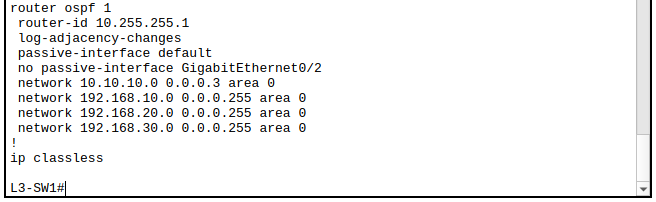

* **L3-SW2 OSPF Configuration**:
  * Router ID `10.255.255.2` configured in `Area 0`.
  * `passive-interface default` enabled, unpassivating uplink `GigabitEthernet0/2`.  
    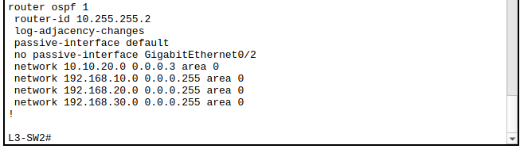

* **Router R1 OSPF Configuration**:
  * Router ID `10.255.255.3` configured with point-to-point transit networks in `Area 0`.  
    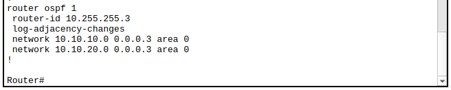

* **Router R1 OSPF Routing Table (`show ip route`)**:
  * Dynamic learning of VLAN subnets (`192.168.10.0/24`, `192.168.20.0/24`, `192.168.30.0/24`) with Equal-Cost Multi-Pathing (ECMP) via `10.10.10.2` and `10.10.20.2`.  
    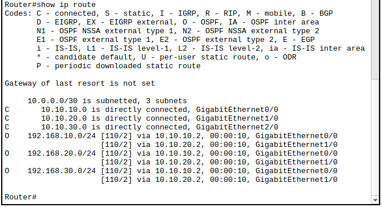

* **Default Gateway Propagation (`O*E2 0.0.0.0/0`)**:
  * **L3-SW1**: Learns default route via OSPF (`10.10.10.1` out `Gi0/2`).  
    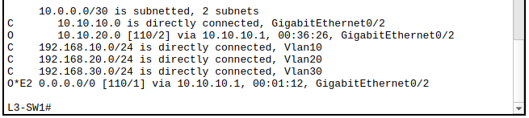
  * **L3-SW2**: Learns default route via OSPF (`10.10.20.1` out `Gi0/2`).  
    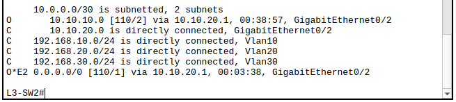

---

## 9. Centralized DHCP Service Configuration

* **Router R1 DHCP Pools & Exclusions**:
  * Excludes default gateway & management range `.1 - .10` across all VLANs.
  * Dedicated DHCP pools configured for `IT` (VLAN 10), `HR` (VLAN 20), and `SALES` (VLAN 30) with gateway and DNS server assignments.  
    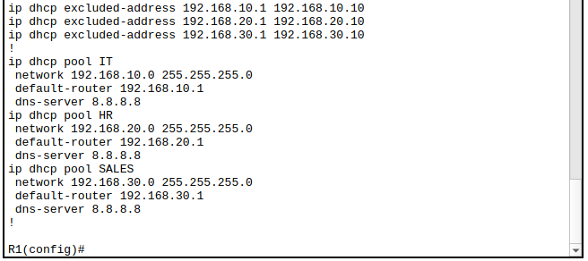

---

## 10. Inter-VLAN Traffic Filtering (Extended Access Control Lists)

* **L3-SW1 Extended ACL (`BLOCK20_TO_30`)**:
  * Blocks inter-VLAN IP communication bidirectionally between `192.168.20.0/24` (HR) and `192.168.30.0/24` (Sales), permitting all other traffic.  
    

* **L3-SW2 Extended ACL (`BLOCK20_TO_30`)**:
  * Symmetrically configured across both core switches for full redundant enforcement.  
    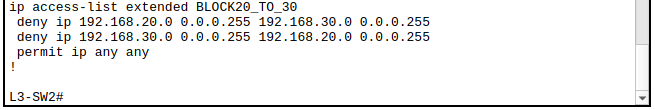
